<h1 align="center">基于SpringBoot的线上医院挂号与后台管理系统【带论文】</h1>

- <b>完整代码获取地址：从戎源码网 ([https://armycodes.com/](https://armycodes.com/))</b>
- <b>技术探讨、资料分享，请加QQ群：692619798</b>
- <b>作者微信：19941326836  QQ：3645296857</b>
- <b>承接计算机毕业设计、Java毕业设计、Python毕业设计、深度学习、机器学习</b>
- <b>选题+开题报告+任务书+程序定制+安装调试+论文+答辩ppt 一条龙服务</b>
- <b>所有选题地址 ([https://github.com/Descartes007/allProject](https://github.com/Descartes007/allProject)) </b>

## 一、项目介绍

基于 Spring Boot 的线上医院挂号与后台管理系统，主要参与角色为：后台管理员、普通用户/会员、专家。主要功能模块和各角色职责如下：
### 用户 / 会员（前端用户）：
- 登录/注册/登出/找回密码
### 浏览专家列表、查看专家详情
- 发起挂号预约（订单）、查看订单详情、取消预约
- 论坛发帖/评论、查看专家留言
### 专家：
- 专家注册、资料维护、查看个人预约/订单
- 接收/处理预约（含审核 shenhe）
- 回应留言、参与论坛互动
- 后台管理员（管理端）：
- 用户/会员/专家 管理：分页/列表/详情/新增/修改/删除/批量导入
- 订单管理：分页/审核/详情/删除
- 论坛与留言管理：帖子管理、留言管理

## 二、项目技术

- 编程语言：Java (后端)、Vue (前端)
- 项目架构：B/S 架构

## 三、运行环境

- JDK版本：1.8及以上都可以
- 操作系统：Windows7/10、MacOS
- 开发工具：IDEA、Ecplise、MyEclipse都可以

## 四、数据库配置文件

- npm版本：6.14.13及以上都可以
- Redis版本：3.2.100及以上都可以
- 文件名：application.yml
- 编码类型：utf8

## 论文截图

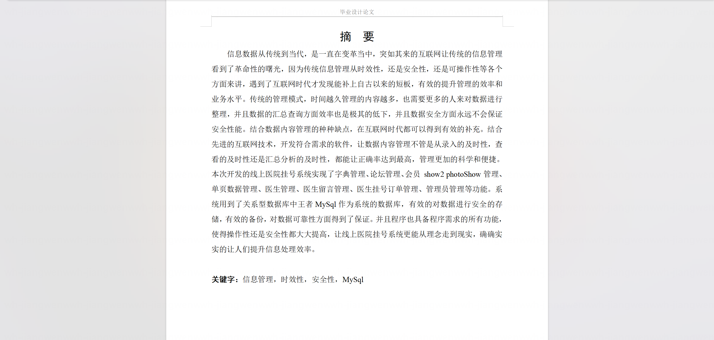

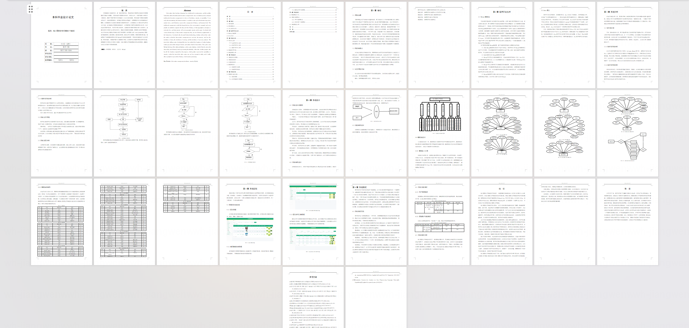

## 系统截图

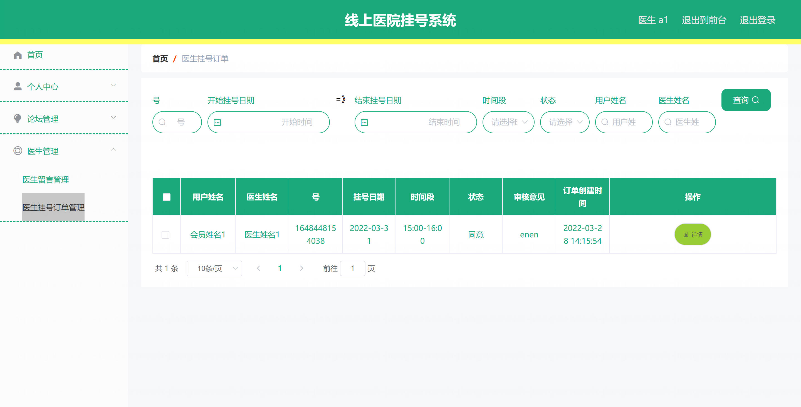

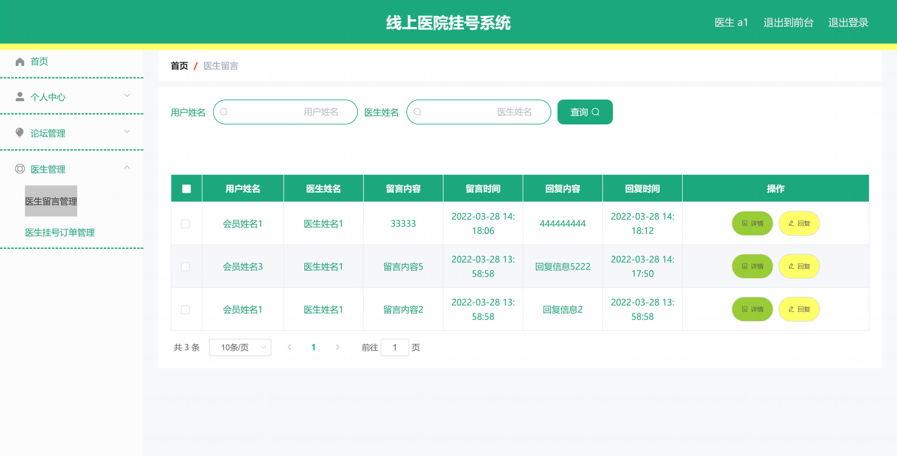

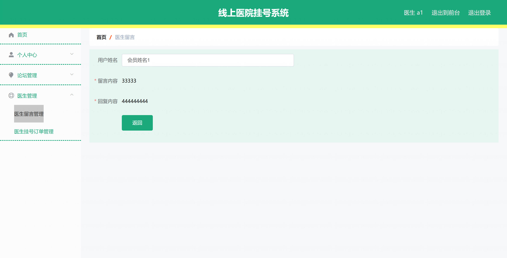

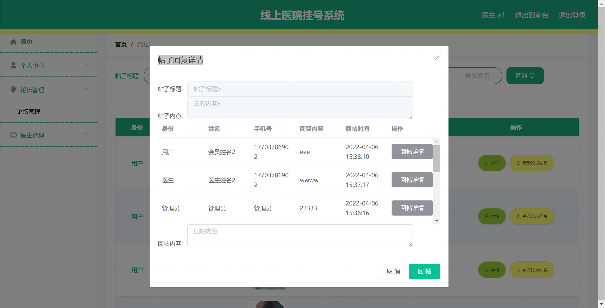

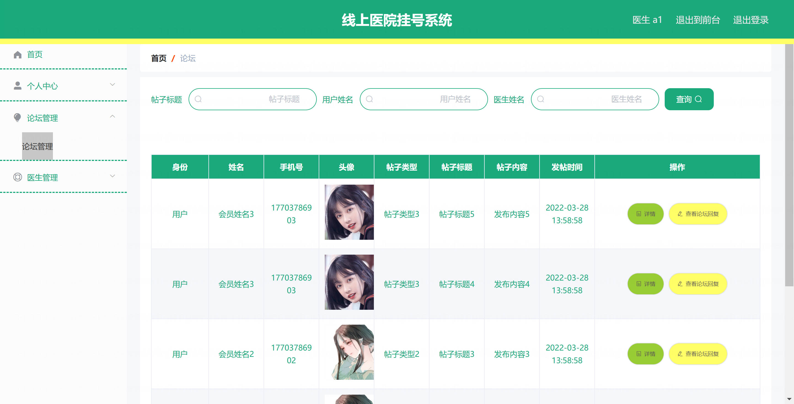

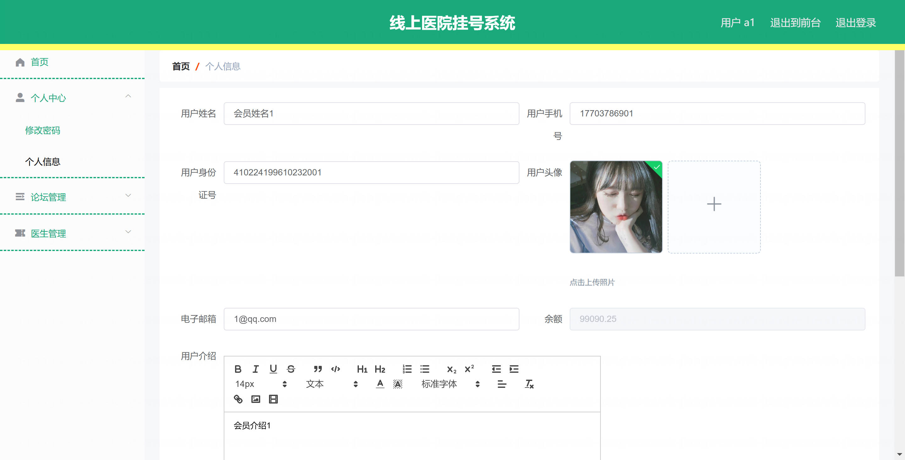

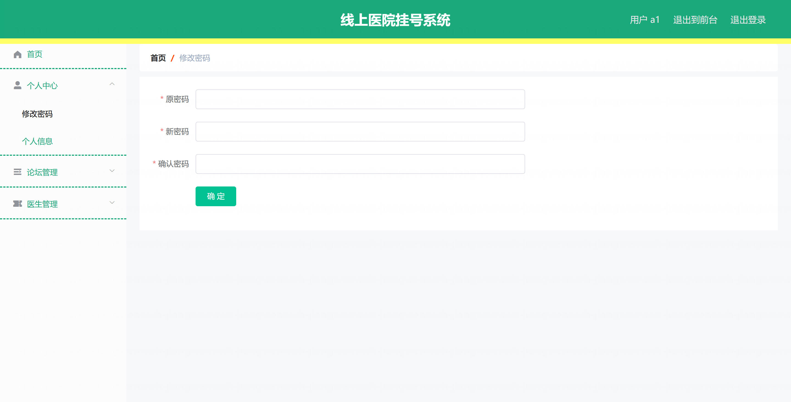

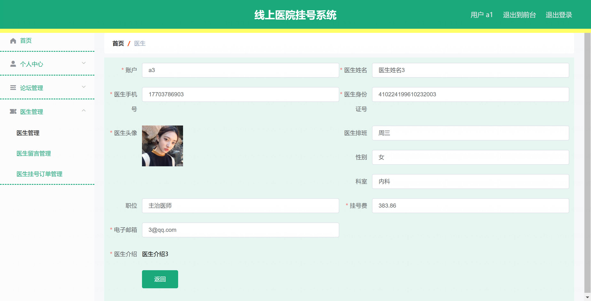

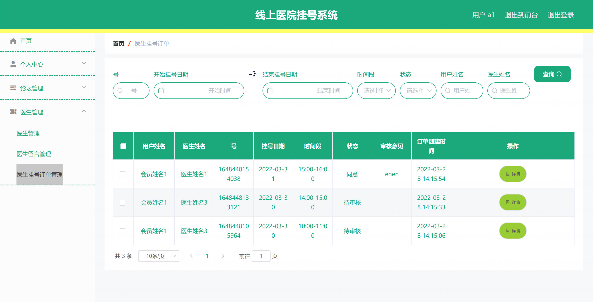

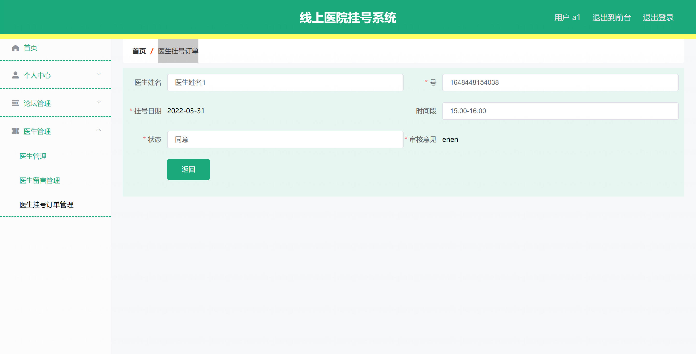
